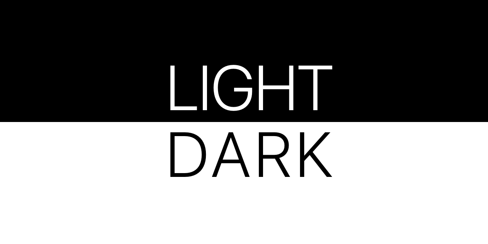
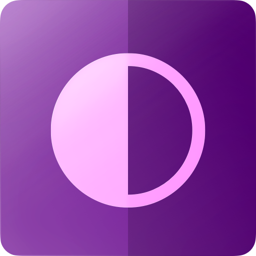
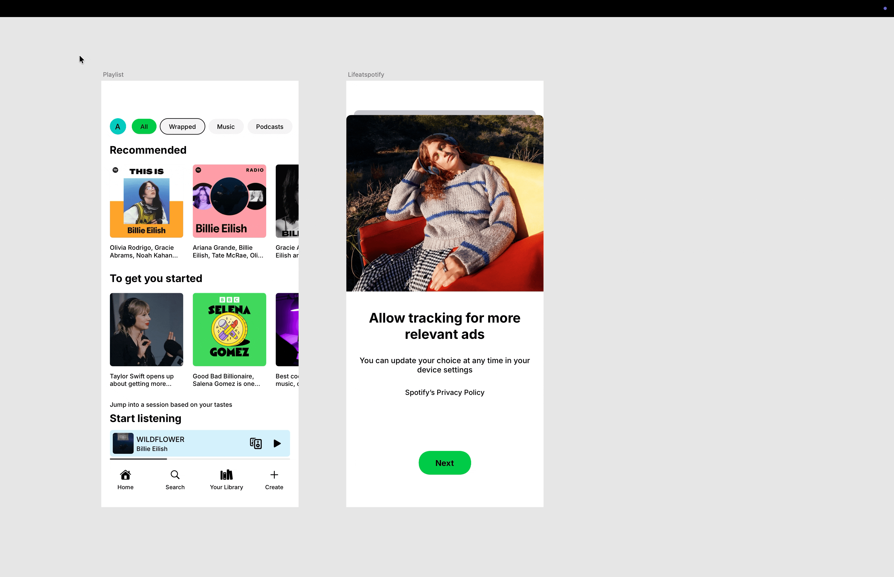
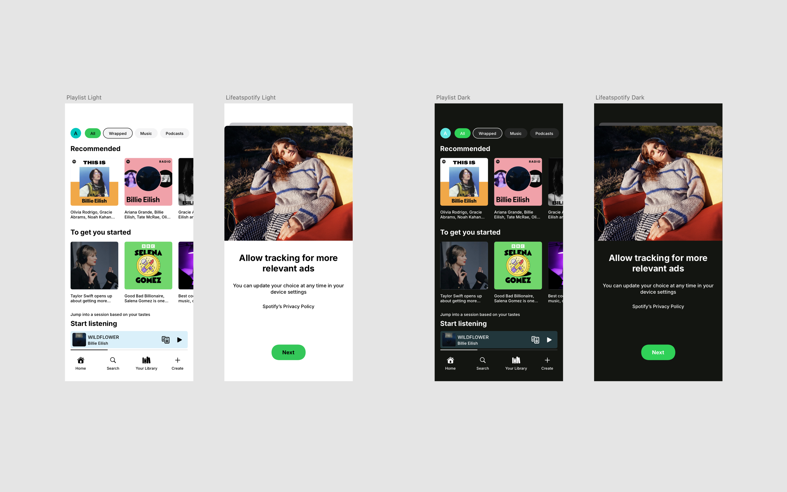

  

  

<h1 align="center">Dusk — Sketch Plugin</h1>

Switch your design between <b>Light</b> and <b>Dark</b> — Instantly.

  

 
 
<h1 align="center">Demo</h1>

Dusk allows you to instantly switch any selected design between Light and Dark themes using your existing color variables, styles, overrides, gradients, and shadows.

  

 
 
<h1 align="center">Before / After</h1>

Instantly convert your design between Light and Dark themes across entire frames, symbols, and libraries.

  

 
 
<h1 align="center">Prerequisites (Color Variables Setup)</h1>

Before using Dusk, organize your color variables in Light and Dark groups. 
Swatch naming format msut be like 
Category / Tone / Name 
   
Example:
	•	Brand / Light / Primary 
	•	Brand / Dark / Primary

  

 
 
<h1 align="center">How to Use</h1>

Select any Frame, Symbol, or Layer 
Go to Plugins → Dusk → Switch Theme 
Your design will instantly switch to Light or Dark

 
 
<h1 align="center">Features</h1>

Light ↔ Dark theme switching •	Works with Color Variables •	Supports Symbols •	Supports Overrides •	Supports Gradients •	Supports Shadows •	Works with Library Styles •	Fast and safe conversion •	Built for Design Systems

 
 
<h1 align="center">Installation</h1>

  Download the plugin using the button above 
  Unzip the file 
  Double click dusk.sketchplugin 
  Open Sketch 
  Go to Plugins → Dusk

 
 
<h1 align="center">Special Thanks</h1>

  Huge thanks to the Sketch team for their incredible JavaScript API and continuous improvements that made plugins like this possible.

